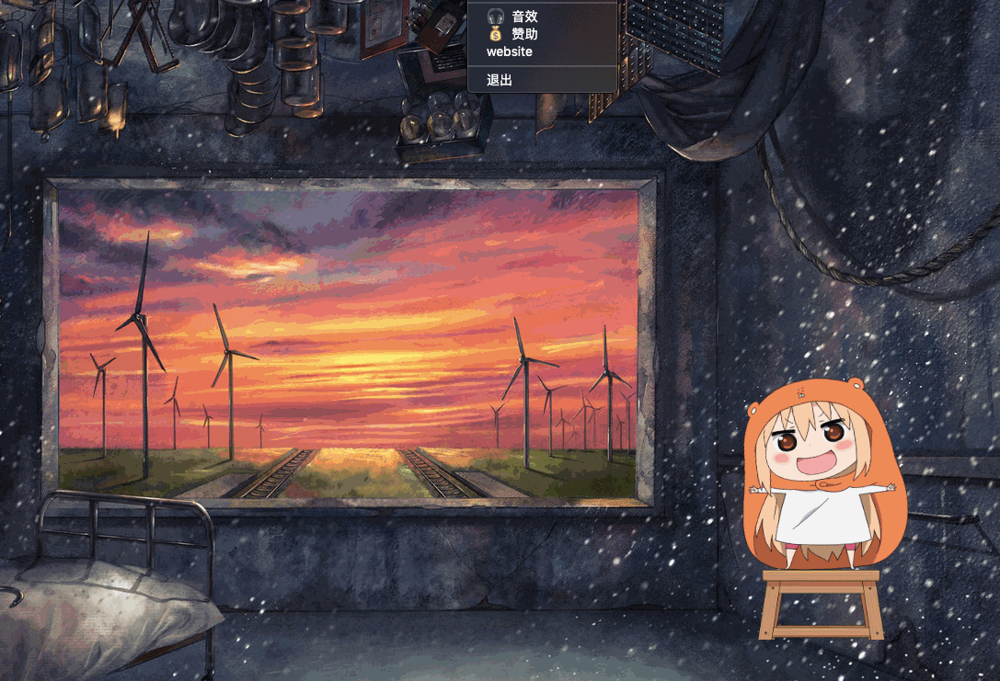

# Elf 

<a href="https://github.com/caijinyc/Here/releases"></a>




> 使用Electron、live2D开发的一款二次元桌面应用。

---

### 相关地址

一 [构建跨平台的应用：Electron](https://electronjs.org/ "electron")

一 [二次元技术-live2D](https://www.live2d.com/ja/ "live2D")

一 [live2D Web插件](https://github.com/fguby/live2D "live2D")

### 快速开始

1.下载示例代码
```
git clone https://github.com/fguby/Elf.git
```
2.进入目录
```
cd Elf
```
3.安装依赖并运行

```
npm install && npm start
```

### 支持功能
- [x] 模型切换
- [x] 内置音效
- [x] 窗口拖放
- [x] 消息弹框 


### TODO

- [ ] 电量监控
- [ ] 消息模块完善
- [ ] 换装功能
- [ ] mac通知栏开发
- [ ] 等等等


> 如果喜欢的话，不妨给个star，然后watching这个项目。


