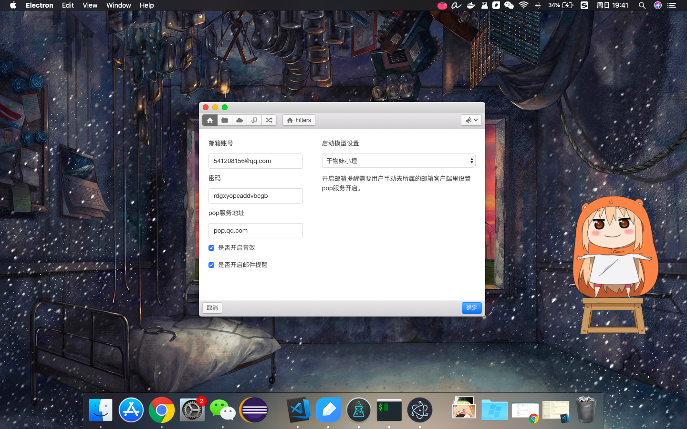
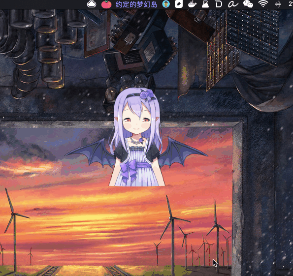
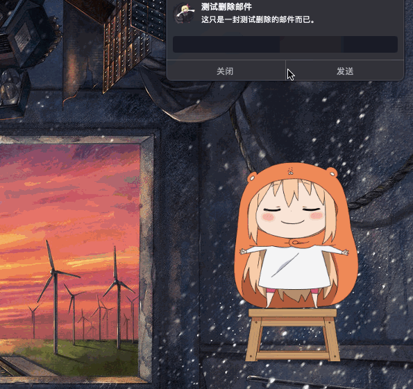
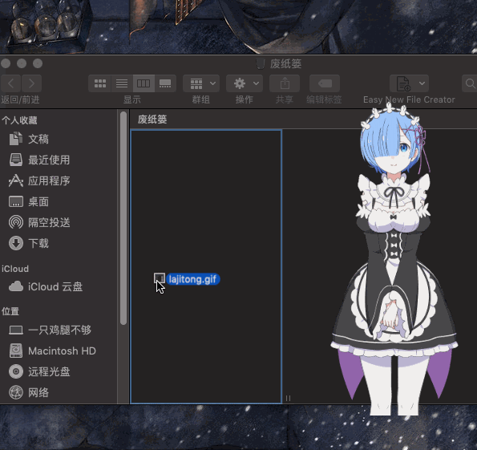
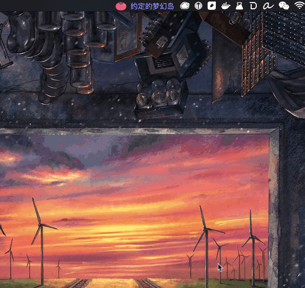
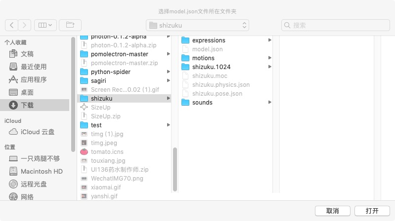
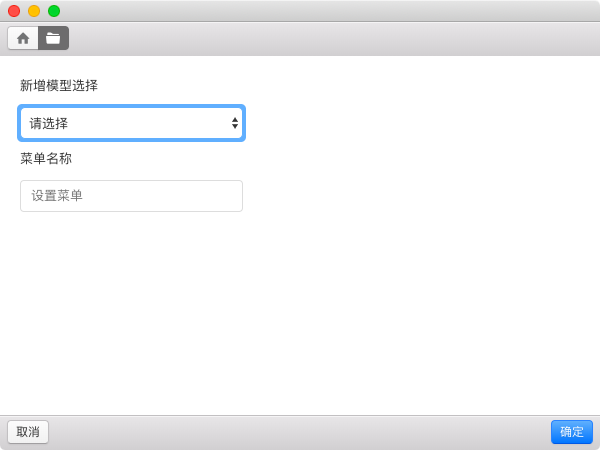
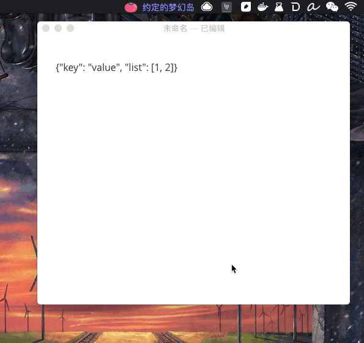

# Desktop Elf  

<a href="https://github.com/fguby/Elf/releases"></a>
[](https://travis-ci.org/fguby/Elf)

[](https://gitter.im/Electron-elf/community?utm_source=badge&utm_medium=badge&utm_campaign=pr-badge)

[English Document](https://github.com/fguby/Elf/blob/master/README-en.md "elf")


> 使用Electron、live2D开发的一款二次元桌面应用。

### φ(≧ω≦*)♪
如果你喜欢，请给我一颗⭐️✨ 

---

### 相关技术

一 [构建跨平台的应用：Electron](https://electronjs.org/ "electron")

一 [二次元技术-live2D](https://www.live2d.com/ja/ "live2D")

一 [live2D Web插件](https://github.com/fguby/live2D "live2D")

### 快速开始

1.下载示例代码
```
git clone https://github.com/fguby/Elf.git
```
2.进入目录
```
cd Elf
```
3.安装依赖并运行

```
npm install && npm start
```

### 支持功能
- [x] 模型切换
- [x] 内置音效
- [x] 窗口拖放
- [x] 消息弹框（已暂时删除）
- [x] 换装功能
- [x] 自定义菜单标题文字
- [x] 一些有趣的小功能
- [x] mac通知栏开发(简易的删除邮件方式？)
- [x] 本地上传自定义模型
- [x] 文本邮件收取以及通知
- [x] 附件邮件自动下载附件至本地
- [x] 快捷键切换模型以及换装
- [x] 拖动文件至模型区域触发删除功能

#### 一个大概的系统设置界面？

#### 快捷键随机换装

#### 邮件收取以及mac通知栏通知

#### 回复RM命令删除邮件

#### 拖动文件到模型区域可删除文件

#### 菜单标题更换为ip


---
### 设置本地模型仓库步骤

- （1）点击菜单栏—>"设置模型仓库"
(选中要上传的文件夹，将模型的json文件统一修改为model.json这个名字，确保系统能读取到。)



- （2）点击‘系统设置’，配置新增模型的菜单栏文字。



- （3）重启应用。

---

### 一些有意思的小功能展示(即将要做的)

#### json字符串的格式化（使用快捷键command + T试试）


脚本来自于一 [JsonUtils](https://github.com/cnfn/BitBarPlugins/tree/master/JsonUtils "jsonutil")

环境依赖：jq

可以使用以下命令安装

```
brew install jq
```

或者，

[去看看官方的示例？](https://stedolan.github.io/jq/download/ "jq")


### TODO
- [x] 邮箱监控
- [x] 换装功能
- [x] mac通知栏开发
- [x] 上传自定义模型
- [ ] 一些有趣小功能的开发(显示ip，天气等)
- [ ] 快捷键自定义设置
- [x] 废纸篓功能
- [ ] 自定义邮件附件的存储位置
- [x] mac通知栏添加回复行，可直接删除邮件
- [ ] 各个模块的自定义配置页面(初始启动模型设置、衣服设置......)
- [ ] 等等等......


> 如果喜欢的话，恳请给予一个star，持续watch这个项目最好啦。

一 [这里是最新的测试版dmg文件:alien:](https://github.com/fguby/Elf/releases/tag/v1.0.0/ "Elf")


---


功能 | 快捷键
---|---
切换模型 | command + Y
切换衣服 | command + J
格式化json字符串 | command + T

～～暂时只支持两个快捷键，后续请期待。～～
新增第三个快捷键(请注意，这个功能的使用需要依赖一些额外的东西，详情请往上翻。)

### 意见以及BUG反馈
一 [issues:speech_balloon:](https://github.com/fguby/Elf/issues "welcome")

最近正在学go，关于项目的重构如果有时间的话应该会进行的，也欢迎大家fork、提issues，watching这个项目，我个人邮箱(fgubyhhh@163.com)

### ~~想请我喝一罐肥宅快乐水吗？~~
</img>
</img>