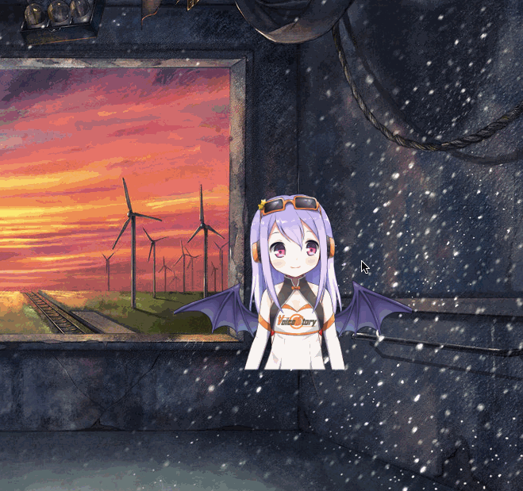

# Desktop Elf 


<a href="https://github.com/fguby/Elf/releases"></a>
[](https://travis-ci.org/Alamofire/Alamofire)


> A secondary desktop application developed using Electron and live2D.

---

### Related technology

一 [Electron](https://electronjs.org/ "electron")

一 [live2D](https://www.live2d.com/ja/ "live2D")

一 [live2D Web](https://github.com/fguby/live2D "live2D")

### Quick start

1. Download the sample code

```
git clone https://github.com/fguby/Elf.git
```

2. Enter the directory

```
cd Elf
```

3. Install dependencies and run

```
npm install && npm start
```

### Supported functions

- [x] model switching
- [x] Built-in sound
- [x] window drag and drop
- [x] Message box (temporarily deleted)
- [x] Dressup function
- [x] mac notification bar development (easy way to delete mail?)
- [x] text mail collection and notification
- [x] Attachment mail automatically downloads attachments to local
- [x] Shortcuts to switch models and dress up
- [x] Drag file to model area to trigger delete function

#### A rough system settings interface?


#### Shortcut change clothing



#### Mail collection and mac notification bar notification


#### Reply to RM command to delete mail


#### Drag files to the model area to delete files


### TODO

- [x] Mailbox monitoring
- [x] Dressup function
- [x] mac notification bar development
- [ ] Model remote download
- [ ] Message module perfect
- [ ] Shortcut Custom Settings
- [ ] Drag model file to add to local
- [ ] Customize the storage location of email attachments
- [ ] mac notification bar to add a reply line, you can directly reply or delete the message
- [ ] Custom configuration page for each module (initial startup model settings, clothes settings...)
- [ ] wait wait wait......

> If you like, please give a star, it is best to keep watching this project.

一 [The latest version of the test dmg file:alien:](https://github.com/fguby/Elf/releases/tag/v0.1.1/ "Elf")

---

function | hot key
--- | ---
Switching model | Command + Y
Shortcut change clothing | Command + J

For the time being, only two shortcut keys are supported. Please follow up later.

### Comments and BUG feedback

An [issue:speech_balloon:](https://github.com/fguby/Elf/issues "Welcome")
